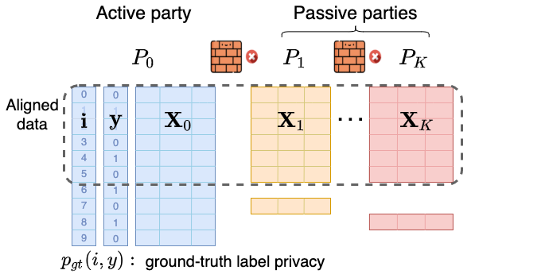
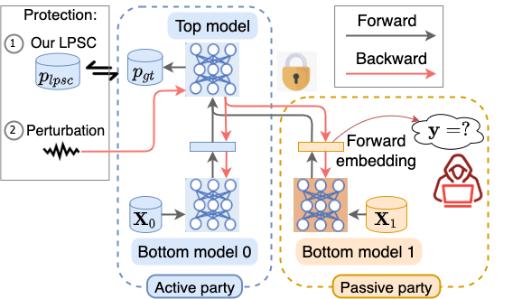

# Label Privacy Source Coding in Vertical Federated Learning

## Abstract

We study label privacy protection in vertical federated learning (VFL).
VFL enables an active party who possesses labeled data to improve model performance (utility) by collaborating with passive parties who have auxiliary features.
Recently, there has been a growing concern for protecting label privacy against semi-honest passive parties who may surreptitiously deduce private labels from the output of their bottom models.
However, existing studies do not remove the prior label information in the active party's features from labels in an offline phase, thus leaking unnecessary label privacy to passive parties.
In contrast to existing methods that focus on training-phase perturbation, we propose a novel offline-phase data cleansing approach to protect label privacy without compromising utility.
Specifically, we first formulate a Label Privacy Source Coding (LPSC) problem to remove the redundant label information present in the active party's features from labels, by assigning each sample a new weight and label (i.e., residual) for federated training.
We give a privacy guarantee and theoretically prove that gradient boosting efficiently optimizes the LPSC problem.
Therefore, we propose Vertical Federated Gradient Boosting (VFGBoost) framework to address the LPSC problem.
Moreover, given that LPSC only provides fixed privacy enhancement,
VFGBoost further enables a flexible privacy-utility trade-off by incorporating adversarial training during federated training.
Experimental results on four real-world datasets substantiate the efficacy of LPSC and the superiority of our VFGBoost framework.

--------

### Requirements

`torch, tensorboardX, deepctr_torch, tqdm, pandas, sklearn`

--------

### Problem Setting

This paper considers the multi-party vertical federated learning problem setting as follows:

The multi-party VFL problem setting. An active party $P_0$ owns uniformly-weighted labeled data $\{I, Y, X_0\}$. The passive parties ${\{P_i\}}_{i=1}^N$ have aligned unlabeled data $\{X_i\}_{i=1}^{N}$.

### LPSC v.s. Previous perturbation methods

In this paper, we focus on defending label privacy leakage from forward embeddings.

Vanilla VFL trains model with uniformly-weighted original labels $p_{gt}(i,y)$. A semi-honest passive party attacks label privacy from the forward embedding. Our LPSC replaces $p_{gt}(i,y)$ with optimized re-weighted residuals $p_{lpsc}(i,y)$ and enhances label privacy for free.

--------

## Framework

The framework of VFGBoost.

1. In the offline Label Privacy Source Coding (LPSC) phase, the active party $P_0$ computes the re-weighted residuals $\mathcal{D}_{lpsc} = (\mathbf{w}, \mathbf{r})$ by training a local model $f_{\theta}$ on labeled data ${\{\mathbf{i}^{loc}, X_0^{loc}, \mathbf{y}^{loc}\}}$.

2. In the federated training phase, a federated model is trained via a utility objective (learn $p_{lpsc}(i,y)$, red arrows) and privacy objectives (unlearn $p_{gt}(i,y)$, green arrows) to further enable trading utility for privacy.

------

## Dataset Preprocessing Details

We work with four datasets in our experiments: two recommendation datasets (Criteo and Avazu) and two healthcare datasets (MIMIC-III and Cardio).

**Criteo** dataset consists of ad click data over a week. For the Criteo dataset, each record contains 27 categorical input features and 14 real-valued input features. To prepare the data for our experiments, we first replace all missing categorical feature values with a single new category represented by an empty string, and replace all missing real-valued feature values with 0. We then convert each categorical feature value to a unique integer between 0 and the total number of unique categories, and linearly normalize each real-valued feature into the range [0, 1]. We randomly sample 10,000,000 records from the publicly provided Criteo training set and split the data into an 80%-20% train-test split for faster training and to generate privacy-utility trade-off comparisons.
https://labs.criteo.com/category/dataset/

**Avazu** contains 10 days of click logs. It has a total of 23 fields with categorical features including app id, app category, device id, etc. The missing categorical features are processed in the same way as the Criteo dataset. We use all available records in the dataset and randomly split the data into an 80%-20% train-test split.
https://www.kaggle.com/c/avazu-ctr-prediction

**MIMIC-III** is a dataset designed for the in-hospital mortality prediction task, which involves predicting in-hospital mortality based on the first 48 hours of a patient's ICU stay. The dataset comprises 714 features and 20,000 records. To simulate multiple hospitals with shared services (features), we evenly split the features among seven parties at random. We use all available records in the dataset and randomly split the data into an 80%-20% train-test split.

`Johnson, Alistair EW, et al. "MIMIC-III, a freely accessible critical care database." Scientific data 3.1 (2016): 1-9.
`

**Cardio** comprises 246 real-valued features such as age, gender, diabetes, blood pressure, obesity, and more. These features were collected from 3,569 patients to predict whether a patient has cardiovascular disease. To simulate multiple hospitals with shared services (features), we evenly split the features among seven parties at random. We use all available records in the dataset and randomly split the data into an 80%-20% train-test split.

The Statistics of each dataset are shown in Table .

| Dataset   | \# Train /Test | \#Num. Feature | \#Cate. Fields | \#Num. Parties |
|-----------|----------------|----------------|----------------|----------------|
| Criteo    | 8,000,000/ 2,000,000 | 13 | 26 | 7 |
| Avazu     | 8,000,000/ 2,000,000 | 0 | 21 | 5 |
| MIMIC-III | 16,912/ 4228 | 714 | 0 | 7 |
| Cardio    | 2,856/ 713 | 246 | 0 | 7 |

**Table 1:** Statistics for all four datasets.

--------

## Model Architecture Details

**[Criteo, Avazu]**: We use a popular deep learning model DeepFM by default for online advertising.
DeepFM is a hybrid model that combines factorization machines and deep neural networks for recommendation tasks. It has two main components: a factorization machine that captures pairwise feature interactions and a deep neural network that learns higher-order interactions and non-linear dependencies. The model takes input features and passes them through both components before concatenating the outputs and passing them to a final output layer.
We follow the default model architecture configurations in the DeepCTR framework.
All active and passive parties have the same deep model architecture. The embedding dimension is set as 4.
The architectures of EDCN, NFM and WDL used in the experiments are also the default model architecture configurations in the DeepCTR framework.

**[MIMIC-III, Cardio]**: We use a 3-layer MLP model in each party to learn the mortality rate in MIMIC-III and the cardiovascular disease in Cardio. The dimension of each layer are [128, 64, 1].

--------

## Model Training Details

The models are optimized by Adam.
Table 2 shows the mdoel trainng details on four datasets. We use the Adam optimizer. The boosting model weight $\alpha$ to 1, the privacy coefficient $\beta$ to 0.05.
We use 5-fold validation to determine early stopping. There are 50% samples aligned across all parties.

| Dataset   | Optimizer | lr    | Batch Size | Epoch |
|-----------|-----------|-------|------------|-------|
| Criteo    | Adam      | $1e-4$ | 2,048      | 5     |
| Avazu     | Adam      | $5e-4$ | 4,096      | 5     |
| MIMIC-III | Adam      | $5e-4$ | 16,912     | 200   |
| Cardio    | Adam      | $5e-4$ | 2,856      | 200   |

**Table 2:** Experimental settings for different datasets.

--------

## Project structure

The VFGBoost algorithm is implemented in `vertical_fl/fit_VFGBoost.py`

The datasets are saved in `raw_data/`

The running scripts for each dataset are: `run_VFGBoots_{dataset_name}.py`

The checkpoints are saved in `checkpoints/`

The log files are saved in `logging/`

The tensorboard results are saved in `tensorboard/`

